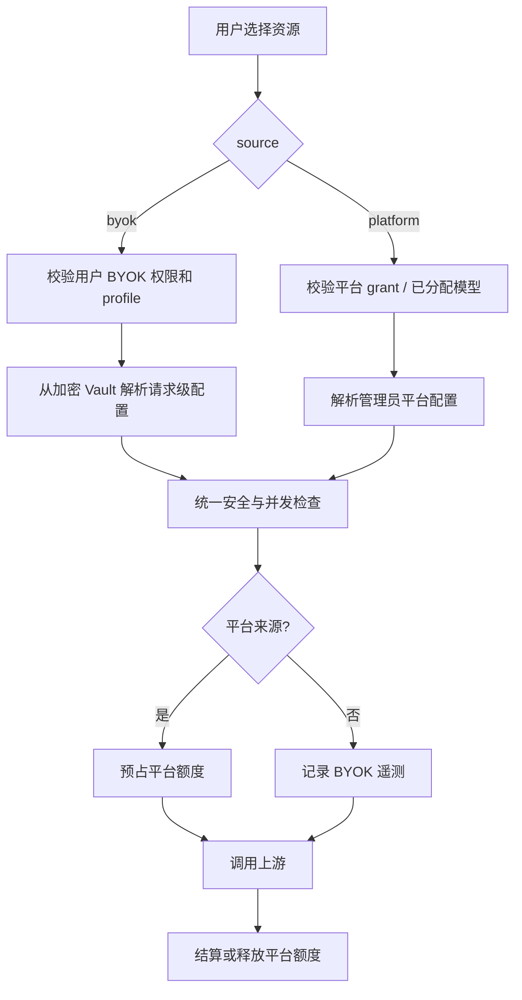

# 多用户 BYOK（LLM / Embedding / MinerU）规格与实施计划

状态：设计评审稿
范围：DeepTutor 公网多用户部署
目标版本：BYOK v1

## 1. 已确认的产品决策

以下规则是本规格的固定输入，而不是待讨论项。

| 主题 | 决策 |
| --- | --- |
| 支持范围 | 普通用户可为 **LLM、Embedding、MinerU Cloud** 各自配置 BYOK。 |
| 默认来源 | 新注册用户在已配置有效 BYOK 时，默认使用 BYOK。 |
| 平台资源 | 管理员可按用户开启平台 LLM、Embedding、MinerU，并设置三类平台额度。 |
| 两种来源并存 | 同一用户可以同时拥有 BYOK 和平台资源；用户可明确切换来源。 |
| 扣费/额度 | 仅使用平台资源时扣平台 LLM token、Embedding token、MinerU page quota；BYOK 不扣这些平台消费额度。 |
| 安全边界 | BYOK 不改变沙盒、文件、工具、MCP、KB、并发或网络访问权限；这些限制继续由管理员策略和现有授权控制。 |
| 管理员权限 | 管理员能配置平台资源、开关用户 BYOK 权限、暂停 BYOK 和查看脱敏审计；管理员不能读取或导出用户的明文 key。 |
| 上线前提 | 公网 BYOK 必须启用 `auth.enabled=true`、会话身份和角色隔离；认证关闭时一律禁用 BYOK，不能将请求降级为本地管理员。 |

`MinerU BYOK` 在 v1 仅指 MinerU Cloud API token。服务器上的 Local MinerU CLI 没有“用户自带 key”的概念，仍视为平台资源并受平台授权与页数额度控制。

## 2. 背景与现状

当前多用户实现已具备三类 SQLite 额度账本：LLM token、Embedding token、MinerU page。它们会在上游调用前预占额度，并在成功、失败或流式结束后结算/释放。普通用户目前只能使用管理员在 `model_catalog.json` 中配置的 LLM；Embedding 与 MinerU 则是全局平台配置。

关键现状与约束如下：

| 现有能力 | 当前实现 | BYOK v1 的调整 |
| --- | --- | --- |
| LLM 平台授权 | `models.llm` grant + 服务端过滤 | 保持不变，并增加 `byok` 选项来源。 |
| Embedding / MinerU 平台配置 | 全局管理员配置 | 改为调用时解析 `platform` 或 `byok` 来源。 |
| 三类额度 | `usage.sqlite3` 预占/结算 | 仅平台来源进入消费额度账本；BYOK 写独立用量遥测。 |
| 用户设置 | 非管理员看不到 catalog 与平台 key | 新增仅属于当前用户的 BYOK 设置页；密钥永不回显。 |
| 沙盒 | `exec_enabled`、隔离策略、并发/速率控制 | 不受 BYOK 影响。 |

实现中必须避免复用全局进程环境变量（例如 `OPENAI_API_KEY`）承载用户 key，也不能把用户 key 放进 grant、聊天请求、日志或前端状态。

## 3. 概念与来源解析

### 3.1 术语

| 名称 | 含义 |
| --- | --- |
| 平台来源（`platform`） | 管理员管理的模型 catalog、Embedding profile 或 MinerU 配置；使用时消耗平台额度。 |
| BYOK 来源（`byok`） | 当前用户私有、加密保存的 credential profile；仅该用户可选择。 |
| Credential profile | 一份可验证的用户凭据加非敏感配置，例如 provider、模型、endpoint、解析选项。 |
| 资源来源选择 | 每次实际 LLM / Embedding / MinerU 调用的 `source`，固定为 `platform` 或 `byok`。 |
| 平台额度 | 管理员定义的可计费消费额度，不是 BYOK 访问权限开关。 |
| 运行安全限制 | 文件体积、单文件页数、上传、请求速率、并发、SSRF 防护、沙盒策略等；两种来源都生效。 |

### 3.2 请求级来源选择



规则：

1. 用户可以保存多个 LLM BYOK profiles，以及各一个默认 Embedding、MinerU Cloud profile；界面可在后续版本扩展为多 profile 切换。
2. 若当前服务存在有效 BYOK profile，初始选择为 BYOK；没有 BYOK 时，若平台资源已授权，界面显示明确的“使用平台资源”选择。
3. 一旦用户明确选择 BYOK，认证失败、限流或余额不足时**不得静默回退到平台**。回退会产生未预期的平台成本，必须由用户再次明确选择平台来源。
4. 请求的 `source`、profile id、模型/引擎选择均由服务端重新校验；客户端提供的任意 `api_key`、`base_url`、`source` 越权字段一律拒绝。
5. 持久化选择仅保存公开引用：`service`、`source`、`profile_id`、`model_id`、`profile_generation`。现有 `LLMSelection` 必须扩展 `source=platform|byok` 与 profile owner 校验，禁止把 key 或 endpoint secret 写入选择对象。

## 4. 服务行为矩阵

| 服务 | BYOK 支持 | 平台支持 | 默认/选择 | 平台额度 | 不可绕过的限制 |
| --- | --- | --- | --- | --- | --- |
| LLM | provider + key + endpoint + model | 管理员已分配 LLM models | BYOK 优先；可切平台模型 | 平台 LLM token 日/月额度 | 最大输出、请求速率、并发、工具/MCP/sandbox policy。 |
| Embedding | provider + key + endpoint + model + dimension | 管理员平台 embedding profile | 新 KB 默认取 BYOK；可选平台 | 平台 Embedding token 日/月额度 | 批量大小、文本/附件上限、索引隔离、SSRF 防护。 |
| MinerU | Cloud API token + Cloud settings | Local CLI 或管理员 Cloud token | BYOK Cloud 优先；可切平台 MinerU | 平台 MinerU 日/月/单文件 page quota | PDF 可读性、文件体积、单文件页数、安全解压、队列/并发。 |

### 4.1 LLM

- BYOK profile 的 provider 必须来自受支持的 provider registry；默认仅开放官方 provider endpoint。
- 自定义 OpenAI-compatible endpoint 默认关闭。管理员可在全局策略中允许固定 allowlist；普通用户不得提交任意内网地址或自定义 header。
- 用户可从自己的 profile 中选择模型；平台模型仍只来自现有 `models.llm` grant。
- Provider 返回 usage 时写入 BYOK telemetry；未返回 usage 时使用估算值并标记 `estimated=true`，仅用于用户用量展示和运维观察，不扣平台额度。

### 4.2 Embedding

- 每个知识库必须保存一个不含 secret 的 `embedding_contract`：`binding`、规范化 endpoint、model、dimension、source kind。
- 只要 contract 的模型、端点或维度发生变化，旧向量索引不得继续复用；界面要求重新索引或新建索引版本。
- 更换同一 provider/model 的 API key 不触发重建索引，因为它不会改变向量空间。
- 解析/索引异步任务只保存 `user_id + profile_id + generation`；执行时从 Vault 解析 key。任务 payload、错误详情与索引元数据都不能包含 key。

### 4.3 MinerU

- BYOK 仅允许 `mode=cloud`，用户的 PDF 仍经 DeepTutor 后端上传给 MinerU；UI 必须明确提示文件会发送到该用户选择的第三方服务。
- 平台 `mode=local` 的成本不是 API token，但仍占服务器 CPU/GPU、磁盘与队列；它属于平台资源，要求管理员授权。
- `max_pages_per_file` 是运行安全限制，不因 BYOK 取消；日/月页数仅在平台来源扣减。
- BYOK Cloud 仍适用单用户并发上限、全局 MinerU worker 上限、上传大小限制、下载解压限制与任务超时。

## 5. 授权与策略模型

### 5.1 全局 BYOK 策略（管理员）

新增 `data/system/byok_policy.v1.json`，仅保存非密钥策略：

```json
{
  "version": 1,
  "enabled": true,
  "default_source": {
    "llm": "byok",
    "embedding": "byok",
    "mineru": "byok"
  },
  "services": {
    "llm": {
      "enabled": true,
      "allowed_bindings": ["openai", "anthropic", "google", "openrouter"],
      "allow_custom_endpoints": false
    },
    "embedding": {
      "enabled": true,
      "allowed_bindings": ["openai", "gemini", "jina", "cohere", "siliconflow"],
      "allow_custom_endpoints": false
    },
    "mineru": {
      "enabled": true,
      "allow_cloud": true
    }
  }
}
```

全局策略决定“系统是否接受这一类 BYOK”；用户 grant 决定“该用户是否能使用”。两层任一拒绝即 fail closed。

### 5.2 用户 grant v3

现有 `grant.version=2` 扩展为 v3，仍禁止任何 secret 字段。新增的逻辑结构：

```json
{
  "version": 3,
  "models": { "llm": [] },
  "platform": {
    "embedding": { "enabled": false },
    "mineru": { "enabled": false }
  },
  "byok": {
    "llm": { "enabled": true },
    "embedding": { "enabled": true },
    "mineru": { "enabled": true }
  },
  "quota": {
    "llm": { "daily_tokens": 100000, "monthly_tokens": 1000000 },
    "embedding": { "daily_tokens": 1000000, "monthly_tokens": 10000000 },
    "mineru": { "daily_pages": 50, "monthly_pages": 500, "max_pages_per_file": 50 }
  }
}
```

语义：

- `models.llm` 继续是平台 LLM 的可选模型集合；为空即没有平台 LLM。
- `platform.embedding.enabled`、`platform.mineru.enabled` 是新增的显式平台权限，避免“配置了全局服务即所有用户可消费”。
- `byok.*.enabled` 默认均为 `true`，但管理员可按用户暂停；暂停不删除用户密钥。
- `quota` 的三个区块均明确标记为“平台消费额度”。BYOK 使用不从这些计数中扣除。
- 用户的来源偏好不写入 grant，而写入私有 Vault 元数据；这样管理员能控制权限，却不能替用户选择或读取其密钥。

### 5.3 迁移兼容性

1. 读取 v1/v2 grant 时，以现有 `normalize_grant()` 的容错方式生成 v3 内存视图。
2. 已有 LLM `models.llm` 完全保留。
3. 为避免升级后突然中断已存在用户，迁移任务会为旧用户创建明确的 `platform.embedding.enabled=true`、`platform.mineru.enabled=true` 初值，并在管理员后台显示“需复核平台资源授权”。
4. 新注册用户的 `platform.embedding/mineru` 默认 `false`；BYOK 默认 `true`。
5. 任何旧客户端提交 v2 grant 时不应抹掉 v3 字段：服务端 merge/normalize 后返回 v3；前端上线必须与后端同版本发布。

## 6. 凭据 Vault 与密钥安全

### 6.1 存储边界

新增 `UserByokCredentialVault`，权威数据位于：

```text
data/system/byok/<user-id>/profiles.v1.json
data/system/byok/<user-id>/state.v1.json
data/system/byok/audit.jsonl
```

该目录位于 `data/system`，不属于用户工作空间，也不得挂载给 sandbox runner。目录权限为 `0700`，文件权限为 `0600`；使用现有 `CodexCredentialStore` 的安全路径、文件锁、原子写入和 generation 模式作为实现模板。

Vault 的持久化记录只含：

- 非敏感 metadata：profile id、服务类型、provider、模型、规范化 endpoint、创建/更新时间、状态、generation；
- `encrypted_secret`：`key_id`、AES-GCM nonce、ciphertext、版本；
- 审计可关联的不可逆 profile fingerprint。

禁止保存、返回或记录：明文 API key、token、Authorization header、完整原始 provider error body、用户 prompt、上传文件内容。

### 6.2 加密与轮换

- 使用 `cryptography` 中的 AES-256-GCM；每次保存产生新的 96-bit nonce。
- 关联认证数据（AAD）固定为 `schema_version:user_id:service:profile_id:generation`，防止 ciphertext 在用户/服务/profile 之间置换。
- 主密钥只由部署 secret 提供，不进入数据卷、不进入 Git、不进入诊断日志。单 VPS 可通过 root-only Docker secret 文件挂载；容器环境变量仅作为兼容路径。
- Vault record 保存 `key_id`。轮换期间配置 keyring：一个 active key 用于新写入，保留旧 key 用于读取；后台任务逐条重新加密，具备断点续跑和审计。
- 主密钥缺失、无效、找不到 `key_id` 或解密失败时，BYOK fail closed；平台路径不受影响。管理员页面显示“BYOK Vault 不可用”，但不显示原因中的密钥信息。
- 备份数据卷时只包含 ciphertext；灾难恢复必须同时从受控 secret store 恢复 keyring。主密钥丢失意味着 BYOK profiles 不可恢复，必须由用户重新录入。

### 6.3 写入、读取与撤销语义

- 只有 profile 所属用户可创建、更新、验证或删除自己的 profile；管理员只能启用/停用该用户的 BYOK 权限，不能读取或导出 profile secret。
- `PUT` / `DELETE` 使用 profile `generation` / `If-Match`，避免浏览器双标签覆盖或删除后旧请求重新写入。
- 删除/禁用后，尚未开始的任务必须失败；已经发往第三方 provider 的请求无法物理撤回，但后续重试不得继续使用已撤销凭据。
- 更新凭据以新 generation 原子提交；请求在开始时解析一次不可变的请求级 config，调用中不读取全局缓存。

## 7. 网络、隐私与执行安全

BYOK 会让不完全可信用户控制 provider 身份和可能的 endpoint，因此它不能沿用管理员可任意填写 URL 的权限模型。

| 风险 | 必须的控制 |
| --- | --- |
| SSRF / 元数据窃取 | 默认只允许 provider registry 的官方 HTTPS endpoint；自定义 endpoint 必须由管理员 allowlist。解析 DNS 后拒绝 loopback、RFC1918、link-local、CGNAT、IPv6 local/metadata 等地址，并在请求连接时再次校验。 |
| Header / token 注入 | 普通用户不能提交任意 `extra_headers`；认证 header 仅由 provider adapter 根据 Vault secret 构造。 |
| 密钥泄露 | 密钥字段仅在 HTTPS `PUT`/`POST` 请求体中出现一次，后续 GET 永不回显；Pydantic `SecretStr`、日志 scrubber、前端 password input、无浏览器持久化。 |
| 未预期平台成本 | BYOK 失败绝不自动回退平台；来源选择与用量日志可见。 |
| 服务器资源滥用 | 两种来源都保留文件/附件上限、每文件页数、请求超时、用户并发与全局 worker 队列。 |
| 沙盒越权 | `exec_enabled`、MCP allowlist、容器隔离、每用户 sandbox concurrency/rate limit 完全独立于 BYOK；拥有 key 不能获得 `exec`。 |
| Provider 数据外发 | MinerU BYOK 及任意云 Embedding 均在 UI 标明“内容将发送到该 provider”；用户确认后方可保存/使用。 |

## 8. 配额、用量与一致性

### 8.1 两类账本

| 数据 | Source of truth | 含义 |
| --- | --- | --- |
| 平台消费额度 | 现有 `usage.sqlite3` 的 token/resource tables | 仅 `source=platform` 的 LLM / Embedding / MinerU 预占、结算和限制。 |
| BYOK telemetry | 新增 `byok_usage` 表或独立 SQLite table | 不做硬扣费；记录来源、profile fingerprint、provider、模型、成功/失败、reported/estimated units、时间与 request id。 |
| Sandbox rate/concurrency | 现有 sandbox quota / runtime policy | 与 credential source 无关，继续生效。 |

平台额度流程维持现有语义：调用前 `BEGIN IMMEDIATE` 预占；成功按 provider usage 或保守估算结算；失败释放；重复 finalize 幂等。BYOK 不产生平台额度 reservation，但必须有唯一 `request_id` 供 telemetry 幂等写入。

### 8.2 额度语义

- LLM：平台来源预占 prompt estimate + max output；BYOK 只统计 reported/estimated token。
- Embedding：平台来源预占 embedding token；BYOK 只统计文本 token estimate 或 provider usage。
- MinerU：平台来源预占 PDF page；BYOK Cloud 不扣日/月 page quota，但永远检查 `max_pages_per_file`、上传大小、队列和超时。
- 管理员仍可为所有用户设置“运行安全上限”（例如最大单请求 token、最大 PDF 页数、BYOK 每分钟请求数）；这不是平台配额，不能用 `0=无限` 使公网服务失控。

### 8.3 可观测性和修复

- 每条调用关联 `request_id`、`user_id`、`source`、服务、profile fingerprint、provider、模型、单位数、计量方式、结果码和延迟。
- telemetry 失败不应让成功的 provider response 失败，但必须写 warning/metric；平台 quota ledger 失败继续 fail closed。
- 设置页显示按来源拆分的“平台已用额度 / BYOK 最近用量”，不能把二者相加误导为账单。
- 后台提供管理员可运行的 reconciliation：查找超过 TTL 的 active reservation 并安全释放；BYOK telemetry 可按 `request_id` 去重回放。

## 9. API 合约

所有路由都在认证之后执行，`user_id` 从会话/Token 获取，绝不接收客户端指定的 owner id。

| 路由 | 权限 | 作用 |
| --- | --- | --- |
| `GET /api/v1/byok/status` | 当前用户 | 返回全局/个人许可、可用来源、脱敏 profile metadata、当前选择和 Vault health。 |
| `POST /api/v1/byok/profiles` | 当前用户 | 新建 profile；secret 只在本次 body 出现。 |
| `PATCH /api/v1/byok/profiles/{id}` | profile owner | 更新非敏感 metadata 或替换 secret，要求 generation。 |
| `POST /api/v1/byok/profiles/{id}/validate` | profile owner | 用最小、不会触发业务任务的 provider-specific probe 验证；限频。 |
| `DELETE /api/v1/byok/profiles/{id}` | profile owner | 原子撤销并删除 ciphertext。 |
| `PUT /api/v1/byok/preferences` | 当前用户 | 设置每类资源的默认来源/profile；服务端验证可用性。 |
| `GET/PUT /api/v1/admin/byok/policy` | 管理员 | 管理全局开关、provider allowlist、endpoint allowlist、运行安全上限。 |
| `PUT /api/v1/admin/users/{id}/grant` | 管理员 | 现有 grant API 扩展，控制用户 `byok.*` 与 `platform.*`。 |
| `POST /api/v1/admin/users/{id}/byok/suspend` | 管理员 | 暂停指定用户/服务 BYOK，不返回或删除其 key。 |

响应禁止项：`api_key`、`token`、`secret`、`password`、原始 endpoint allowlist 以外的内网地址、provider Authorization header。任何序列化对象都应覆盖 `repr`/JSON redaction 测试。

## 10. 前端体验

### 10.1 普通用户：`/settings/byok`

页面使用三张资源卡：LLM、Embedding、MinerU。

- 显示 BYOK 是否已允许、profile 是否已配置/已验证、最近验证时间和当前默认来源。
- 密钥输入使用 password type；保存成功后只显示“已配置”，不显示末尾字符。
- LLM 卡可管理 profile 和模型；Embedding 卡显示 model/dimension 与受影响的 KB/重新索引提示；MinerU 卡只提供 Cloud token 和明确的数据外发提示。
- 每张卡都可选择“使用我的 key”或“使用平台资源（如已授权）”。平台额度与 BYOK 用量分开展示。
- Key 无效时，错误文案指向该用户的 BYOK profile，不暗示或自动切换到平台。

### 10.2 管理员：`/admin/users` 与 `/admin/byok`

- 删除当前页面无效的“打开用户管理”自链接。
- 在现有 Grant Editor 增加“来源与权限”：BYOK LLM/Embedding/MinerU 开关、平台 Embedding/MinerU 开关，及现有平台 LLM assignment。
- 三类额度卡标题改为“平台资源额度”；当用户选择 BYOK 时显示“BYOK 不扣平台额度，仍受运行安全限制”。
- 新增 `/admin/byok`：全局 BYOK 开关、provider/endpoint allowlist、Vault 健康、轮换状态、按来源的聚合遥测、暂停用户 BYOK。该页面不显示任何用户 secret。

## 11. 后端模块设计与落点

| 模块 | 改动 |
| --- | --- |
| `deeptutor/multi_user/grants.py` | grant v3、来源权限、兼容 normalize/validate。 |
| `deeptutor/multi_user/model_access.py` | 合并平台 model options 与红acted BYOK options，并对 source/profile 做授权校验。 |
| `deeptutor/multi_user/byok_vault.py`（新增） | 0600 安全文件、锁、generation、AES-GCM、keyring、metadata redaction。 |
| `deeptutor/multi_user/byok_policy.py`（新增） | 全局策略、provider/endpoint allowlist、user grant 校验。 |
| `deeptutor/multi_user/execution_source.py`（新增） | 请求级 source resolution、不可变 scoped config、审计上下文。 |
| `deeptutor/services/model_selection/llm.py` / `services/session/turn_runtime.py` | `LLMSelection` 增加 source/profile owner/generation；平台走 grant，BYOK 必须确认 profile 属于当前 authenticated user。 |
| `deeptutor/services/llm/config.py` / `factory.py` | 使用 ContextVar/request-local config；BYOK 不写 `OPENAI_*` 进程环境；仅 platform 走额度 reservation，agentic 与 factory 两条调用链共用 billing policy。 |
| `deeptutor/services/embedding/config.py` / `client.py` | 增加 scoped embedding config/client cache key；移除或隔离进程全局 `EmbeddingClient` 与 LlamaIndex `Settings.embed_model`，每个 KB/index job 解析正确来源。 |
| `deeptutor/services/parsing/engines/mineru/config.py` / `backend.py` | 接受 request-scoped MinerU config，平台/BYOK 分别计量；BYOK 拒绝 local mode。 |
| `deeptutor/multi_user/token_quota.py` | 保持平台账本契约；增加 source-aware telemetry、reservation repair。 |
| `deeptutor/api/routers/byok.py`（新增） | 用户 BYOK CRUD/validate/preferences。 |
| `deeptutor/api/routers/settings.py`、`auth.py`、`router.py` | 统一 session 用户上下文、grant/policy API 和注册默认值。 |
| `web/app/(utility)/settings/byok/page.tsx`（新增） | 用户 BYOK 设置页。 |
| `web/features/multi-user/components/GrantEditor.tsx` | 源权限、平台额度说明、现有授权展示。 |
| `web/app/(admin)/admin/users/page.tsx` | 移除无效自链接，展示新用户默认 source policy。 |

## 12. 实施计划

### Phase 0：设计与部署前置（1 个小版本）

1. 确认单 VPS 还是多实例部署。单实例可先沿用 SQLite WAL + file vault；多副本/滚动发布前必须把 Vault metadata、generation 和额度账本迁移至 PostgreSQL。
2. 将 `auth.enabled=true` 设为 BYOK release gate，并验证 HTTP 与 WebSocket 都不会在未认证时获得本地管理员身份。
3. 配置 Docker secret / 受控环境密钥，生成 BYOK keyring；禁止将 master key 写进 Git、普通数据卷备份或前端环境变量。
4. 落地 provider allowlist、SSRF address validator、出站 egress policy 和全局并发上限。
5. 输出威胁建模和运维 runbook：丢失主密钥、轮换、用户删除 key、provider 故障、审计导出。

验收：未配置主密钥或认证未启用时，BYOK 被显式禁用且平台功能不受影响；含私网/metadata 的 endpoint 被拒绝；容器日志/诊断输出没有 secret。

### Phase 1：Vault、授权与来源解析（基础设施）

1. 实现 `UserByokCredentialVault`、AES-GCM envelope、generation / file lock / atomic writes、secret redaction。
2. 实现 `byok_policy`、grant v3 normalize/migration、平台 Embedding/MinerU 显式授权。
3. 扩展 `LLMSelection` 并实现 `ExecutionSource` ContextVar：`source`、user、profile id、generation、usage origin；所有后端调用只从该上下文取配置。
4. 新增 BYOK API，覆盖 owner isolation、管理员无法读取 key、停用/删除竞争和 validation 限频。

验收：两个用户无法读取、引用或调用对方 profile；更新/删除 race 不会恢复旧 key；GET/API/error/audit 无明文密钥。

### Phase 2：LLM BYOK（先上线）

1. 将 LLM resolver/factory/agentic client 全面接入 request-local config，移除 BYOK 对全局环境变量和全局 client cache 的依赖；agentic 与 factory 共用同一 source-aware billing policy。
2. 合并平台与 BYOK LLM options；后端验证 `source + profile + model`。
3. 增加 source-aware usage：平台调用保持预占/结算，BYOK 仅 telemetry；禁止失败时自动 fallback。
4. 完成用户 LLM 设置卡、来源选择、profile validation、审计和错误文案。

验收：并发的 A/B 用户使用不同 OpenAI-compatible keys 时绝不串 key；同一用户切换 BYOK/平台时只有平台调用扣额度；sandbox grant 不因 BYOK 改变。

### Phase 3：Embedding BYOK 与 KB 兼容

1. 增加 scoped embedding config/client 与索引 job snapshot/reference；移除或隔离进程全局 `EmbeddingClient` 和 LlamaIndex `Settings.embed_model`，避免不同用户的 key 或向量空间串用。
2. 在 KB manifest 写 `embedding_contract`，实现不兼容时的 reindex gate。
3. 平台/BYOK Embedding 用量拆分，保留文本和批量安全上限。
4. 完成 Embedding UI、KB 受影响提示、重新索引流程。

验收：不同模型/维度不能查询旧索引；同 model 的 key rotation 不触发重索引；BYOK embedding 不扣平台额度且完整记录 telemetry。

### Phase 4：MinerU BYOK 与队列安全

1. 将 MinerU config 变为 request-scoped，BYOK 强制 cloud mode；保留平台 local/cloud 路径。
2. 平台 page quota 保持预占/结算；BYOK 保留页数、文件、队列和超时安全限制。
3. 完成 MinerU profile validate、文件外发告知、错误映射与来源审计。
4. 实现用户/全局 MinerU 并发闸门和取消/超时清理。

验收：BYOK token 无法开启本地 CLI；平台 quota 耗尽不阻断 BYOK；BYOK 无法突破单文件页数或并发上限。

### Phase 5：管理员体验、迁移、可观测性与上线

1. 更新 `/admin/users`：移除无效自链接，增加 BYOK/平台授权与“平台额度”标签。
2. 提供 `/admin/byok` policy、Vault health、suspension、聚合用量和 key rotation status。
3. 运行 v2→v3 grant migration，导出迁移报告，要求管理员复核已有 Embedding/MinerU 的平台授权。
4. 完成端到端回归、负载/并发测试、日志扫描、备份恢复演练和回滚方案。

验收：旧用户不会在升级时静默丢失原有访问；新用户默认 BYOK；管理员可以开启平台资源并让用户显式切回平台；公网部署健康检查、注册、沙盒、三类额度均无回归。

## 13. 测试与验收清单

- [ ] LLM / Embedding / MinerU 三类 profile 的创建、更新、验证、删除、暂停与恢复。
- [ ] 用户 A 无法列举/使用用户 B 的 profile；管理员 API 也无法返回 B 的 secret。
- [ ] 密钥不出现在 HTTP 响应、日志、traceback、audit、浏览器 localStorage、导出或备份明文中。
- [ ] Platform 与 BYOK 的 LLM / Embedding / MinerU 用量分别记账，失败/retry/stream cancel 不重复扣费。
- [ ] 平台 active reservation 超过 TTL 后由 reconciliation 幂等释放；进程在 reserve 后异常退出不会永久占用用户额度。
- [ ] 旧 grant、旧前端、旧数据库在滚动发布期间可读；迁移可重复执行。
- [ ] 自定义 endpoint / DNS rebinding / loopback / RFC1918 / metadata endpoint 被拒绝。
- [ ] 用户 BYOK 无法访问未授权的模型、KB、技能、MCP 或 sandbox `exec`。
- [ ] Embedding contract 改变时强制重新索引；MinerU BYOK 不绕过上传、页数、超时和并发限制。
- [ ] 主密钥轮换、主密钥缺失、Vault 文件损坏均 fail closed，且平台调用仍可正常工作。

## 14. 发布与回滚

1. 先部署仅包含 Vault / policy 的向后兼容版本，保持 BYOK global policy `enabled=false`，并确认 `auth.enabled=true` 已在 HTTP 与 WebSocket 生效。
2. 完成主密钥、备份、SSRF guard、迁移 dry-run 和日志扫描后，按服务分批开启 LLM → Embedding → MinerU BYOK。
3. 每个服务开启后，用一个测试用户验证 BYOK、平台、来源切换、额度和沙盒。
4. 出现问题时关闭对应服务的全局 BYOK policy；已保存 ciphertext 保留，平台路径即时恢复。不要通过删除 Vault 文件回滚。
5. 多副本部署在 Phase 1 前必须使用 PostgreSQL / 共享事务存储承载 Vault metadata 与额度账本；LiteLLM 的数据库不应直接复用表结构，建议使用独立 schema 或独立数据库连接。

## 15. 明确不做

- 不把用户 API key 下发到浏览器后直接调用 provider。
- 不允许用户通过聊天 payload 传递临时 `api_key` 或任意 `base_url`。
- 不让 BYOK 自动解锁 sandbox、shell、MCP、管理员模型、其他用户 KB 或平台无限额度。
- 不对 BYOK 失败做隐式平台 fallback。
- 不支持 BYOK 形式的服务器 Local MinerU CLI；它始终是平台资源。
- 不把 key 保存在 grant、普通用户 workspace、模型 catalog、浏览器 storage 或审计日志中。
