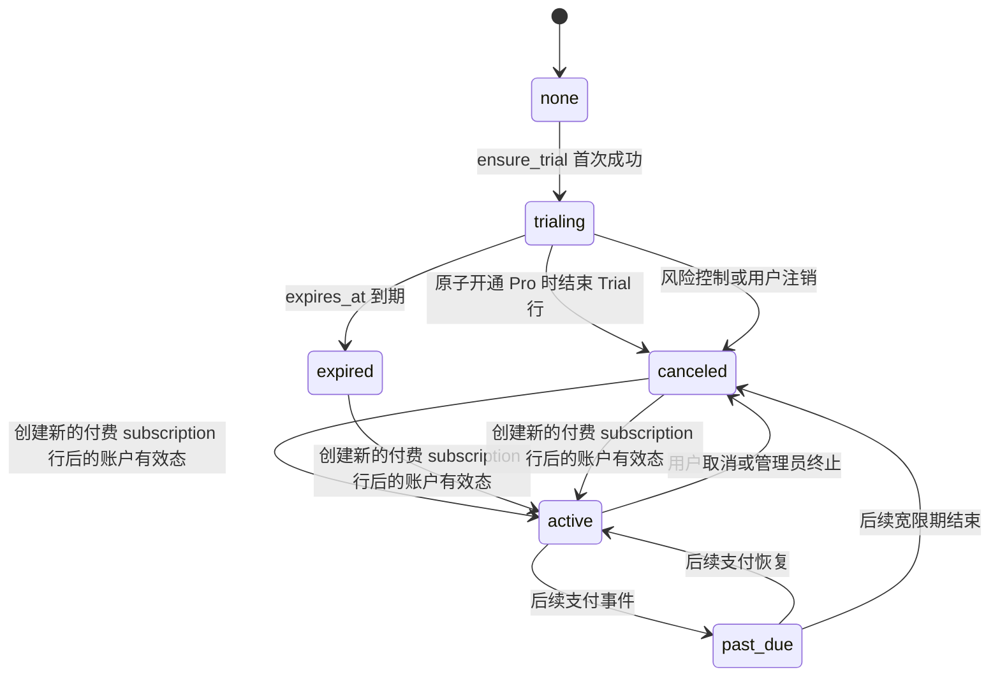

# 导学吧（LearnLeader）商业基础与试用版规格

状态：实施中（技术范围已确认；首发市场与收款主体待产品确认）

目标版本：Commercial Foundation v1

范围：Phase 0 商业定义、Phase 1 安全闸门、Phase 2 SaaS Control Plane、7 天无卡试用

## 1. 目标

导学吧（LearnLeader）Commercial Foundation v1 的目标不是完成收款，而是建立一个能够安全承载后续收费的个人 SaaS 基础：公共用户可以注册并获得一次受限试用；平台可以可靠地识别账户、订阅状态、套餐权益和用量；试用过期后服务端会停止新的付费资源消费，同时保留用户读取、导出和删除自己数据的能力。

本阶段完成后，支付渠道只需通过后续的 Provider Adapter 向 Control Plane 写入已验证的订阅状态，不得再修改身份、Grant JSON 或业务数据目录。

## 2. 本阶段产品实现基线

| 主题 | 决策 |
| --- | --- |
| 首发客户 | 暂定工作假设：个人学习者，优先服务需要阅读资料、建立知识库并持续深度学习的用户；需用首轮访谈和试用数据确认。 |
| 产品形态 | 托管 Web SaaS；开源自托管版继续作为 Community 入口。 |
| 首发套餐 | 一个 `trial` 和一个 `pro`，暂不做多档价格、团队席位或按量超额收费。 |
| 试用方式 | 注册成功后自动获得一次 7 天无卡试用；同一平台账户不得重复领取。 |
| 权益来源 | 套餐权益、部署安全策略、管理员人工覆盖分别保存，运行时求交集。 |
| 超额处理 | 试用期只允许硬停止并提示等待正式订阅；不产生欠费，不允许负余额。 |
| BYOK | BYOK 是资源来源，不是绕过订阅的通道；试用过期后托管版 BYOK 同样停止新的生成任务。 |
| Sandbox | 普通用户的公开 sandbox/exec 不进入本阶段，必须等逐用户隔离完成后再作为套餐权益。 |
| 支付 | 本阶段不接支付 SDK、Checkout、续费、退款或发票；数据模型保持 Provider 无关。 |

### 2.1 Commercial Brand v1

Brand v1 作为独立工作流与安全闸门、Control Plane 并行推进，但必须服从同一商业定义。商业品牌统一为中文 `导学吧`、英文 `LearnLeader`；Community 与托管产品使用同一母品牌，通过 `导学吧社区版 / 导学吧试用版 / 导学吧 Pro` 和 `LearnLeader Community / LearnLeader Trial / LearnLeader Pro` 区分产品形态。仓库、Python import、包名和开源兼容标识在本阶段不做破坏性重命名，仍暂保留 `deeptutor`，避免影响自托管用户和升级路径。

命名说明：`LearnLeader` 表达“带领学习者走向掌握”，不沿用 `DeepTutor` 词根。快速检索已发现近似教育品牌 `LearningLeaders` 与 `Learn with Leaders`，因此当前按产品决定使用，但正式发布前仍必须完成域名、公司名称、商标和各目标市场近似商标的专业检索。Apache 2.0 许可证的版权授权不等于商标或商品名称授权，因此品牌名与开源代码名分离管理。

当前 `Agent-Native Learning` 更像技术架构说明，不作为面向个人学习者的主价值表达。Commercial Brand v1 的建议主张是“把资料变成真正掌握的知识”，英文工作稿为 `Turn information into mastery.`。最终中英文标语须在首轮目标用户访谈后锁定，不能把“准确无误”“替代教师”或“保证学习效果”作为品牌承诺。

| 设计层 | Brand v1 决策 | 交付物 |
| --- | --- | --- |
| 品牌性格 | 冷静、可信、好奇、循序渐进；避免万能 AI、机器人和炫技型表达。 | 定位句、价值主张、语气与禁用词清单。 |
| Logo | 保留“书本 + 学习路径/智能伙伴”的识别资产，但重绘为简洁矢量标志；必须同时支持单色、反白和 16px 小尺寸。 | 主标、图标、横版组合、单色版、clear space 与最小尺寸规则。 |
| Wordmark | 停用当前难以缩放且与产品 UI 不一致的手写体图片字标；使用可维护的字体字标或定制矢量字标。 | `SVG` 源文件以及 `PNG`、favicon、Apple touch icon、Open Graph 导出。 |
| 色彩 | 以现有 Cream 主题的 Ink、Paper、Terracotta 作为母品牌基线，Sky Blue 只作辅助；主题可以改变交互色，但品牌标志不能随主题随机变色。 | 品牌色、语义色、暗色映射、对比度表和 CSS tokens。 |
| 字体 | 继续使用 Geist 作为产品正文和控件字体；Lora 仅用于少量编辑型标题，不在表单、导航和计数状态中使用。 | 中英文字阶、字重、行高和降级字体规则。 |
| 图形语言 | 用“资料 → 理解 → 练习 → 掌握”的学习路径、知识关系和真实学习材料表达能力；不使用机器人头像、霓虹电路或无含义渐变。 | 插图方向、图标规则、动效原则和截图模板。 |

Brand v1 不能只替换 Logo 和颜色，必须覆盖完整商业体验：

1. 公共官网说明适用人群、核心工作流、数据与 AI 边界、Community 与托管版差异；托管部署可以用营销首页作为 `/`，自托管部署继续直接进入工作台，不能强迫 Community 用户浏览销售页面。
2. `/pricing` 只展示 Community、7 天 Trial 和 Pro 预告；在 Checkout 未上线前，Pro 只能收集付费意向或显示“即将开放”，不得出现会让用户误以为能够完成购买的按钮。
3. 注册页在提交前清楚显示“7 天、无需绑卡、到期不扣费、核心限制”；登录、验证码、密码找回、数据导出和账号删除使用统一的信任文案与视觉层级。
4. 首次登录 onboarding 只做三个动作：确认学习目标、导入一份材料或直接提问、完成首个有效 turn。所有步骤允许跳过，不能用强制问卷阻塞首次价值。
5. 工作台统一展示 Trial 身份、剩余时间、关键资源余量和限额原因；到期页保留历史、导出与删除入口。支付未上线前不展示“立即订阅”，只展示付费意向入口。
6. 邮件、网页 metadata、favicon、空状态、错误页、文档和社交分享图使用同一名称、标志、语气和版本化资产，不再各自引用不同的 raster Logo。

品牌实施顺序为：先完成定位、命名架构和文案基线；再提供恰好三套有明显差异的视觉方向供选择；方向选定后才重绘资产和改前端；最后用登录、注册、首次使用、Trial 即将到期和 Trial 已到期五条真实路径做视觉与可访问性验收。没有选定视觉方向前，不直接修改生产 UI。

首轮只评审以下三套方向，每套都保留 `导学吧 / LearnLeader` 双语名称与“书本 + 学习路径”的核心识别，不另起第四套折中稿：

| 方向 | 核心表达 | 视觉语言 | 更适合的商业印象 |
| --- | --- | --- | --- |
| A · 知识编辑部（推荐） | 把分散资料整理成可掌握的知识 | Ink / Paper / Terracotta；编辑出版式网格；Lora 只用于少量标题；强调批注、章节和学习轨迹 | 可信、克制、有知识产品质感，和当前 Cream 主题迁移成本最低 |
| B · 认知地图 | 看见知识之间的连接，并沿路径逐步掌握 | Ink / Paper 为底，Sky / Cobalt 作受控强调色；节点、路径、层级和进度成为主要图形语言 | 更现代、更系统，适合突出 Agent、Knowledge Base 与 Mastery Path |
| C · 安静的学习伙伴 | 长期陪伴用户完成理解、练习和复盘 | 暖白与 Ink 为底，Sage / Amber 作强调色；更柔和的圆角、留白和插画摄影方向 | 更亲和、更个人化，适合面向非技术学习者，但需防止做成儿童教育产品 |

方向评审不只看一张 Logo。每套必须使用同一批真实内容输出一组可比较的 Brand Board：横版与图标 Logo、登录首屏、注册 Trial 条款、工作台 Trial 状态、到期状态、浏览器 favicon/metadata，以及中英文各一版。评审只选择一个方向，不在三套之间拼色、拼字体或拼组件。

选定方向后的改造按四个批次落地：第一批建立 `web/public/brand/`、版本化 Logo 资产、favicon 和品牌 tokens；第二批统一登录、注册、密码找回和验证邮件；第三批改造工作台身份、余量、限额和到期体验；第四批补公开首页、`/pricing` 预告、metadata、错误页、文档和社交分享图。每批都保留旧资产引用清单，完成浅色、深色、移动端、中英文与键盘可用性回归后再删除旧引用。

Brand v1 预计 8–12 个工作日，可与 Phase 1、Phase 2 并行。交付目录应统一为 `web/public/brand/`、品牌 tokens、i18n 文案表和一份可维护的 Brand Guide；旧 Logo 在完成引用清单和回归检查后再删除，避免 favicon、邮件或生成文档出现断图。

Brand v1 的验收标准是：Logo 在 16px、浅色、深色和单色环境中可识别；正文和关键控件达到 WCAG AA 对比度；中英文不溢出；Community 不出现误导性的付费入口；Trial 条款在注册前可见；所有商业状态由服务端订阅快照驱动；项目中不存在多个互相冲突的正式 Logo、标语或套餐名称。

## 3. 尚未关闭但不阻塞本阶段的商业决策

| 决策 | 截止点 | 要求 |
| --- | --- | --- |
| 首个付费市场 | Phase 3 支付接入前 | 明确大陆人民币、香港/国际或两者分期，不能仅凭 UI 语言推断。 |
| 收款主体 | Phase 3 支付接入前 | 明确主体所在司法辖区、结算账户、税务与开票责任。 |
| 支付 Provider | Phase 3 支付接入前 | 根据收款主体选择 Stripe、Merchant of Record 或本地合规支付服务商。 |
| Pro 正式价格 | 付费 Beta 前 | 以试用真实成本、激活率和留存数据反推，不在开发阶段拍脑袋确定。 |
| 退款与欠费宽限 | Phase 3 状态机扩展前 | 与支付 Provider、自动续费规则和目标市场要求一起评审。 |

未关闭项必须保留在发布检查表中，但不得阻塞本阶段的安全修复、试用和 Provider 无关 Control Plane。

### 3.1 当前退款与欠费规则

Commercial Foundation v1 只有无卡 Trial，不会产生扣款、退款或欠费。Trial 到期立即停止新的托管资源消费，历史数据继续只读可用；这不是欠费宽限，也不会形成应收账款。管理员人工创建的测试订阅不得被宣传为已购买套餐，不触发自动续费或退款承诺。

Phase 3 接入支付前必须把以下建议基线与收款主体所在司法辖区一起评审后版本化：首次购买冷静期内的退款条件、续费退款条件、退款后权益终止时点，以及 `past_due` 的宽限天数。未形成经法务/财务确认的版本前，系统不得开放真实 Checkout；代码中的 `past_due` 仅是兼容状态，不代表已承诺任何宽限期。

## 4. 套餐与权益矩阵

### 4.1 Community、Trial、Pro

| 能力 | Community 自托管 | Trial 托管试用 | Pro 托管版 |
| --- | --- | --- | --- |
| 运行位置 | 用户自行部署 | 导学吧托管 | 导学吧托管 |
| 期限 | 无 | 7 天，仅一次 | 按订阅账期，后续接支付 |
| Chat / Mastery Path | 由部署者配置 | 开放 | 开放 |
| Deep Solve | 由部署者配置 | 开放 | 开放 |
| Deep Research | 由部署者配置 | 开放，受 credits 限制 | 开放，额度待成本模型确定 |
| Visualize | 由部署者配置 | 开放，禁用高成本 Manim render | 开放，render 权益可独立配置 |
| Deep Question | 由部署者配置 | 开放 | 开放 |
| Knowledge Base | 由部署者配置 | 最多 2 个 | 数量与容量后续定价 |
| BYOK | 由部署者配置 | 允许配置，但仍受试用期限和安全上限约束 | 允许配置 |
| 平台模型 | 由部署者承担 | 有限内部 credits | 包含额度待定 |
| Sandbox / Exec | 部署者自担风险 | 禁止 | 默认禁止，逐用户隔离上线后再开放 |
| Cron / Partners / 任意 MCP | 部署者自担风险 | 禁止 | 后续独立权益 |
| SLA / 支持 | 无 | Beta best effort | 后续正式定义 |

### 4.2 Trial v1 默认限制

| 资源 | 限制 | 语义 |
| --- | ---: | --- |
| 期限 | 7 天 | 从服务端成功创建 trial subscription 的时间开始计算。 |
| 平台模型成本预算 | 2,000 internal credits | 1 credit 对应 0.001 USD 的可归因平台成本；这是公开 Beta 前的预算目标。当前没有权威 price catalog，不伪装成已执行的硬额度。 |
| LLM 安全上限 | 100,000 token/日 | 防止短时滥用；仍同时受总 credits 限制。 |
| Embedding | 500,000 input token/试用期 | 仅平台来源计入；BYOK 仍受 KB、文件和并发限制。 |
| MinerU | 20 页/试用期，10 页/文件 | 防止单次文档吞噬全部解析资源。 |
| Knowledge Base | 2 个 | 删除后可以重新创建，但不能同时超过 2 个。 |
| 托管存储 | 500 MiB | 包括附件、知识库原文件、索引和生成产物。 |
| 单文件 | 25 MiB | 不沿用全局 200 MiB 上限作为试用权益。 |
| 并发 turn | 1 | 同一账户同一时刻只能有一个消耗型 turn。 |

这些数字是付费 Beta 前的安全初值，不是市场承诺。所有限制必须存放在版本化 `plan_version` 中；修改 Trial v2 不得静默改变已经开始的 Trial v1。

## 5. 试用生命周期



Commercial Foundation v1 只主动产生 `trialing`、`expired` 和管理员触发的 `active/canceled`。`past_due` 先进入兼容状态集合，但在 Phase 3 接入支付前不会由系统主动产生。

图中的 `expired/canceled --> active` 描述的是 billing customer 的有效状态变化，不是原 subscription 行被复活。行级状态机禁止 `expired` 或 `canceled` 回到 `active`；开通或恢复付费必须在同一事务内结束旧的 active-like 行并创建一条带 Provider 和新账期的新 subscription。

### 5.1 到期行为

试用到期后，用户仍可登录、查看历史会话、下载自己的产物、导出或删除账户数据。系统拒绝新的 LLM、Embedding、MinerU、KB 索引和其他消耗型任务；正在运行的任务不应被试用到期定时器强制杀死，但其后续分阶段资源预占必须失败。管理员可以暂停、取消或人工开通 Pro，所有动作写入审计。

### 5.2 幂等与失败语义

`ensure_trial(user_id)` 是可重试操作：相同用户的重复、并发或进程重启调用只能得到同一条 trial subscription。账户创建成功而 Control Plane 暂时失败时，身份是权威数据；后台 reconciliation 可以补建尚未领取过的 trial，但不能重置已经开始或结束的试用。

## 6. 单位经济模型

### 6.1 成本边界

每个托管订阅账期必须计算以下成本：

```text
variable_cogs = llm_cost + embedding_cost + parsing_cost
              + sandbox_compute + storage_and_egress + payment_fee

contribution_margin = net_revenue - variable_cogs
contribution_margin_rate = contribution_margin / net_revenue
```

首版 Pro 的平台资源预算必须满足：

```text
platform_variable_cost_ceiling <= 30% * net_subscription_revenue
```

试用没有收入，因此公开 Beta 的目标是每账户 2 USD 的绝对平台成本硬上限，并单独跟踪注册、激活和转化成本。当前实现先按 LLM token、Embedding token 和 MinerU page 做调用前预占；在权威且版本化的 price catalog 上线前，`usage_event` 使用 `unpriced-v1` 并保留 provider、model、usage units 和估算标记，`cost_micros=0` 只表示“尚未定价”，不得解释成零成本或已满足 2 USD 上限。

公开开放平台模型 Trial 前必须补齐 price catalog，并把最坏情况成本换算为 `platform_cost_credits` 做调用前预占；这是发布闸门，不阻塞当前私测 Trial 和 Provider 无关 Control Plane 的完成。模型价格变化不能追溯修改历史用量，每个新价格快照必须使用新的 price version。

### 6.2 核心指标

| 类别 | 指标 |
| --- | --- |
| 激活 | 注册后 24 小时内完成首个有效 turn；创建首个 KB；完成首个 Deep Solve/Research。 |
| 留存 | Trial D1、D3、D7 活跃；试用结束后的付费意向和回访。 |
| 成本 | 每个激活用户的平台成本、P50/P95 单 turn 成本、解析成本、存储增长。 |
| 质量 | turn 成功率、取消率、P95 延迟、KB 解析失败率。 |
| 安全 | 越权拒绝、限流、试用重复领取、异常 credits 消费、被暂停账户调用。 |

正式定价前必须拥有至少一个完整试用批次的真实数据，不能仅依赖静态模型价格表。

### 6.3 单位经济评审模板

每个候选 Pro 价格必须用同一组输入计算，禁止只比较模型 token 成本：

| 输入 | 符号 | 数据来源 |
| --- | --- | --- |
| 含税月费 | `gross_price` | 候选套餐价格 |
| 税费、渠道抽成、支付固定费 | `tax_and_payment_fee` | 收款主体与 Provider 报价 |
| 退款和拒付损失 | `refund_and_chargeback` | Beta 实际率或保守假设 |
| LLM、Embedding、解析成本 | `ai_variable_cost` | `usage_event.cost_micros` 按 price version 汇总 |
| 存储、流量和任务计算 | `infra_variable_cost` | 云账单按活跃订阅归因 |
| 单用户支持成本 | `support_variable_cost` | 支持工时与外包成本 |

```text
net_subscription_revenue = gross_price
                         - tax_and_payment_fee
                         - refund_and_chargeback

variable_cogs = ai_variable_cost
              + infra_variable_cost
              + support_variable_cost

contribution_margin = net_subscription_revenue - variable_cogs
contribution_margin_rate = contribution_margin / net_subscription_revenue
break_even_active_subscribers = fixed_monthly_cost / contribution_margin
```

付费 Beta 的价格评审至少同时展示 P50、P95 和压力场景，且满足：P95 正常用户的 `variable_cogs` 不超过净收入 30%，贡献毛利为正，单个 Trial 的平台归因成本不超过 2 USD。缺少正式 price version 或无法归因的调用按最保守成本计入；`unpriced-v1` 事件必须单列并阻塞公开 Beta，不得当作零成本。

### 6.4 Phase 0 退出清单

当前已完成目标用户假设、产品形态、Trial/Pro 权益框架、Trial v1 限制、状态机、成本公式和本阶段退款/欠费语义。首个付费市场、收款主体、Pro 正式价格及真实支付后的退款/宽限版本仍需产品负责人确认；它们是 Phase 3 Checkout 的硬门槛，不是本次安全闸门和无卡试用的阻塞项。

## 7. 权威数据与一致性规则

| 数据 | 类型 | 权威来源 | 修复方式 |
| --- | --- | --- | --- |
| 身份与认证状态 | durable source of truth | 当前 identity store；后续可迁 PostgreSQL | identity reconciliation |
| Billing customer | durable source of truth | PostgreSQL `billing_customer` | 按 `user_id` 幂等补建 |
| Plan version / entitlement | durable immutable config | PostgreSQL | 只新增版本，不原地改历史版本 |
| Subscription | durable source of truth | PostgreSQL | 状态机 + reconciliation |
| Effective entitlements | derived | subscription + plan + deployment policy + admin override | 随时重算，不单独手工写 Grant |
| Usage event | append-only source of truth | PostgreSQL | 按 request/event key 去重，支持重放 |
| Usage reservation | durable coordination state | PostgreSQL | finalize/release 幂等，超时 reconciliation |
| 页面显示的剩余额度 | derived projection | usage events/reservations | 重算或回填 |

必须维持以下不变量：每个账户最多领取一次 Trial；同一 customer 同时最多存在一个 `trialing` 或 `active` subscription；同一 request/resource 不重复记账；reservation 只能从 `active` 进入一个终态；任何客户端字段都不能直接声明自己是 Pro、增加 credits 或改变账期。

## 8. 安全闸门

Commercial Foundation v1 上线前必须满足：公共注册不会自动产生平台管理员；认证开启时 Cookie 使用安全属性；登录和验证码接口有限流；密码重置不会泄露账户是否存在；用户只能读取、取消、下载和撤销自己拥有的 session、artifact、attachment 和 memory run；普通用户不能修改全局配置或调用平台密钥测试接口；账户删除会清理身份、Grant、BYOK、usage、workspace、会话和文件；普通用户 sandbox/exec 保持关闭。

安全校验必须同时覆盖 HTTP 与 WebSocket。只在前端隐藏入口不算完成。

## 9. Control Plane 数据模型

| 表 | 目的 | 关键约束 |
| --- | --- | --- |
| `billing_customer` | 身份系统用户与商业账户映射 | `user_id` 唯一；不保存密码或支付卡信息。 |
| `plan_version` | 不可变套餐版本 | `(plan_code, version)` 唯一；发布后不可原地编辑。 |
| `entitlement` | 某套餐版本的功能和限制 | `(plan_version_id, key)` 唯一；显式类型和单位。 |
| `subscription` | 试用/Pro 状态和账期 | 每 customer 最多一个 active-like subscription；乐观版本号。 |
| `webhook_event` | 后续支付事件 inbox | `(provider, external_event_id)` 唯一；原始 payload 与处理结果分离。 |
| `usage_event` | 追加式实际用量与成本 | stable dedupe key；禁止更新已结算成本。 |
| `usage_reservation` | 调用前资源预占 | request/resource 唯一；幂等 finalize/release；可超时修复。 |

所有多表状态变化必须在 PostgreSQL 事务中完成。运行服务使用连接池；每个请求/任务借用独立连接，禁止跨并发任务共享事务对象。

## 10. 本阶段不做

本阶段不接支付 SDK、Hosted Checkout、Customer Portal、自动续费、退款、发票、优惠券、欠费催收、团队/组织/席位、多币种、多支付 Provider、用量超额收费、普通用户 sandbox、对象存储迁移、持久任务队列或多副本扩容。

这些能力不能通过临时字段或管理员手工改 Grant 偷跑；后续 Phase 必须以本 Control Plane 的状态机和权益解析接口为基础实现。

## 11. 验收标准

1. 新部署必须通过显式受控流程创建平台管理员，普通公共注册永远不能抢占 admin。
2. 两个用户不能通过 HTTP、WebSocket、artifact URL、attachment/session id 或 memory run id 访问或修改对方数据。
3. `ensure_trial` 重复和并发调用只创建一个 customer 和一个 7 天 Trial v1。
4. 试用有效期内返回版本化权益；到期后所有消耗型服务端入口 fail closed，历史数据保持可读和可导出。
5. Usage reservation 的重试、重复 finalize、release、进程中断和 reconciliation 不会重复扣量或永久占用额度。
6. 没有 PostgreSQL 配置且商业模式未启用时，现有单用户、自托管、多用户 Grant 与 BYOK 行为保持不变。
7. 数据库迁移可重复执行、可观察，并能从空库构建完整 schema。
8. 聚焦测试、全量 Python 测试、Web build、Compose config、凭据扫描和 `git diff --check` 全部通过。

## 12. 商业部署启动方式

商业模式通过 `docker-compose.commercial.yml` 叠加启用，基础自托管 Compose 保持原行为。先将 `commercial.env.example` 复制为 `commercial.env`，在 `data/user/settings/auth.json` 中开启认证和 `cookie_secure`，并准备两个不会提交到 Git 的 Docker secret：PostgreSQL 密码，以及使用同一密码、主机名为 `commercial-postgres` 的完整数据库 URL。

启动命令：

```bash
docker compose --env-file commercial.env \
  -f docker-compose.yml -f docker-compose.commercial.yml config
docker compose --env-file commercial.env \
  -f docker-compose.yml -f docker-compose.commercial.yml up -d
```

商业模式采用 fail-closed 启动：认证、Secure Cookie、显式 bootstrap admin、PostgreSQL URL 或 Trial v1 固定模型绑定任一缺失或无效，API 进程都不得降级为非商业模式继续提供服务。PostgreSQL 数据卷必须纳入备份；数据库密码与 URL secret 必须同步轮换。
